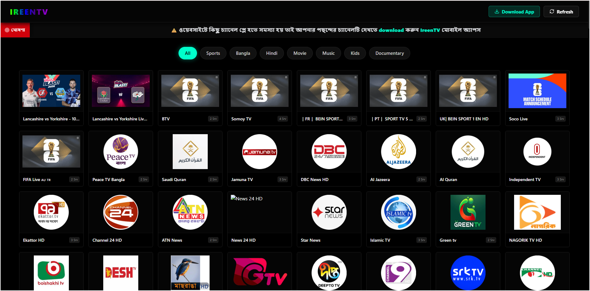
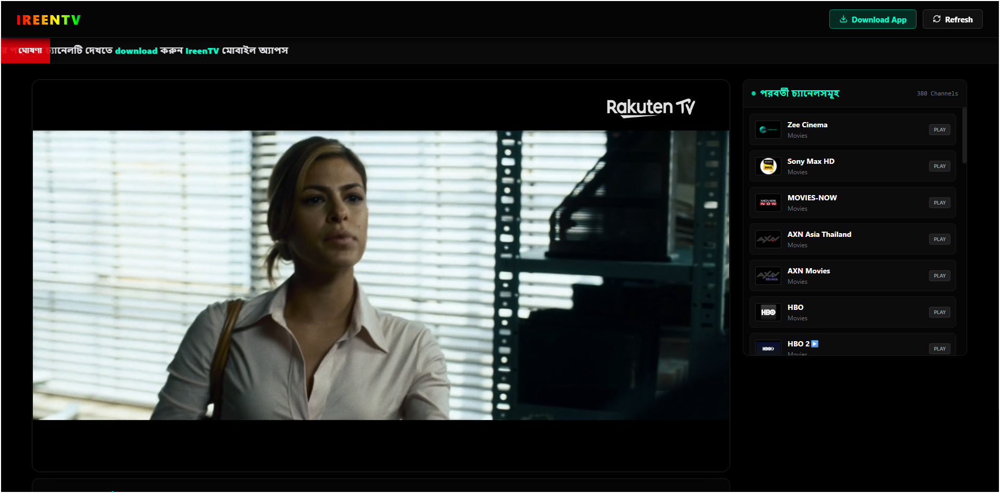
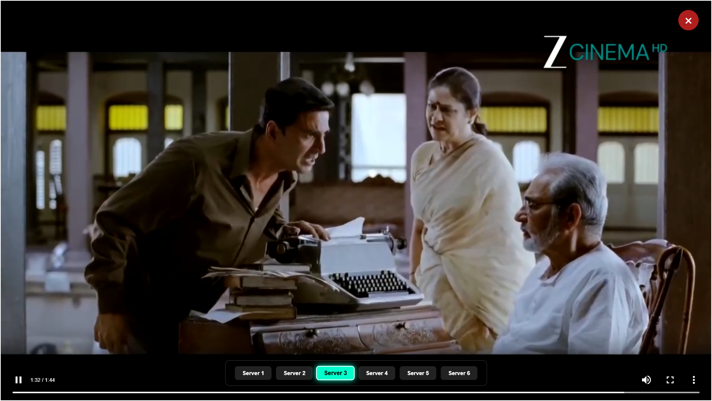
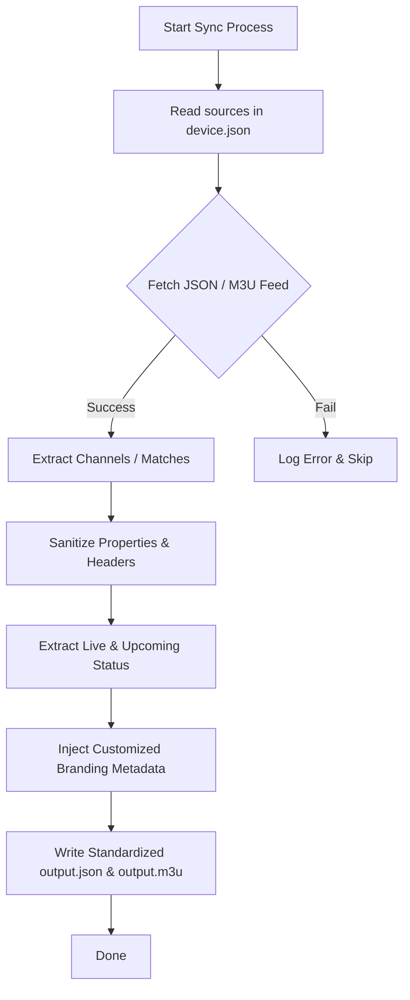

# <p align="center"></p>

<p align="center">
  
</p>

---

<p align="center">
  <a href="https://ireentv.pages.dev/"></a>
  <a href="https://t.me/ireentv"></a>
  <a href="https://github.com/ireentv/IreenTv-Auto-Update-Json-M3U-Playlist/releases"></a>
</p>

<p align="center">
  <b>IreenTV Auto-Update Playlist Engine</b> is a fully-automated, robust synchronization system designed to fetch, parse, and clean live stream links and IPTV playlists (both <b>JSON</b> and <b>M3U</b> formats). It automatically embeds custom branding metadata, normalizes dynamic sports events (including Live and Upcoming matches), and commits the processed playlists directly to your repository via GitHub Actions.
</p>

---

## 🌟 Key Features

*   🔄 **Dual-Format Generation**: Outputs highly optimized `.m3u` and `.json` files simultaneously.
*   📡 **Live & Upcoming Match Parser**: Deep-scans structured match feeds (like *Tapmad BD* API responses). It dynamically handles **Live** streams as well as **Upcoming** sports fixtures, ensuring all match metadata (Video name, description, category, logos, and countdowns) is preserved, even if the stream URL is pending.
*   🏷️ **Automatic Branding Injection**: Automatically embeds custom header details (Owner name, developer, support links, version, and status) at the top of the M3U/JSON playlists.
*   ☁️ **Hands-Free Automation**: Designed for serverless operation using GitHub Actions workflows with cron scheduler support.
*   ⚡ **Smart Key Mapper**: Parses mismatched JSON formats dynamically using a case-insensitive fallback mapping dictionary for properties like logos, URLs, categories, and titles.

---

## 📱 Supported Applications & Ecosystem

Get the complete premium entertainment experience across all your screens with our custom-built applications:

| Platform | Download Link | Description | Screenshot |
| :--- | :--- | :--- | :--- |
| 🌐 **Web Player Portal** | [**Live Web App**](https://ireentv.pages.dev/) | Watch from any browser with a stunning dark theme and live server switching. | [View UI](./assets/screenshot_web.png) |
| 📱 **Android Mobile** | [**IreenTV Mobile.apk**](https://github.com/ireentv/Ireen-TV-Mobile/raw/refs/heads/main/IreenTV%20Mobile.apk) | Visually optimized, touch-friendly player with quick category search for your mobile device. | [View App](./assets/screenshot_sidebar.png) |
| 📺 **Smart TV / Firestick** | [**Smart TV HD.apk**](https://github.com/ireentv/Smart-TV/raw/refs/heads/main/Smart%20TV%20HD.apk) | A remote-control friendly, widescreen 1080p full-screen player optimized for Android TVs. | [View Player](./assets/screenshot_player.png) |

---

## 📸 Screen Previews

<table width="100%">
  <tr>
    <td width="50%">
      <p align="center"><b>Live Streaming UI</b></p>
      
    </td>
    <td width="50%">
      <p align="center"><b>Web Portal Interface</b></p>
      
    </td>
  </tr>
  <tr>
    <td width="50%">
      <p align="center"><b>Channel Explorer Dashboard</b></p>
      
    </td>
    <td width="50%">
      <p align="center"><b>Cinematic Widescreen Player</b></p>
      
    </td>
  </tr>
</table>

---

## 🛠️ How the Sync Script Works

The `sync.py` script automatically processes your playlists defined inside `device.json`. Here is how the synchronization works under the hood:



### ⚙️ Custom Branding Setup
You can personalize the playlist output header directly inside `sync.py` in the `BRANDING` configuration block:

```python
BRANDING = {
    "status": "success",
    "owner": "MD ANAMUL HOQUE",
    "telegram": "https://t.me/ireentv",
    "website": "https://anamul.pages.dev",
    "developer": "IreenTechnology",
    "version": "1.0"
}
```

---

## 🚀 Local Installation & Usage

To run the sync tool on your local machine, follow these easy steps:

### 1. Clone the repository
```bash
git clone https://github.com/ireentv/IreenTv-Auto-Update-Json-M3U-Playlist.git
cd IreenTv-Auto-Update-Json-M3U-Playlist
```

### 2. Install dependencies
```bash
pip install -r requirements.txt
```

### 3. Run the synchronization script
```bash
python sync.py
```
This will read playlists defined in `device.json` and generate your updated output files instantly.

---

## 🤖 Automate with GitHub Actions

To make this script run automatically every hour (or on a custom interval), create a workflow file at `.github/workflows/auto_sync.yml`:

```yaml
name: Auto Update Playlist

on:
  schedule:
    - cron: '0 */2 * * *' # Runs every 2 hours
  workflow_dispatch: # Allows manual trigger

jobs:
  sync:
    runs-on: ubuntu-latest
    steps:
      - name: Checkout Repository
        uses: actions/checkout@v4

      - name: Set up Python
        uses: actions/setup-python@v5
        with:
          python-version: '3.x'

      - name: Install Dependencies
        run: |
          python -m pip install --upgrade pip
          if [ -f requirements.txt ]; then pip install -r requirements.txt; fi

      - name: Run Update Script
        run: python sync.py

      - name: Commit and Push Changes
        run: |
          git config --local user.email "action@github.com"
          git config --local user.name "GitHub Action"
          git add -A
          git diff-index --quiet HEAD || (git commit -m "Auto Update: Playlist Sync $(date -u +'%Y-%m-%d %H:%M:%S UTC')" && git push)
```

---

## 👤 Developer & Community Support

Developed with ❤️ by **MD ANAMUL HOQUE** (IreenTechnology).

*   🌐 **Official Website**: [anamul.pages.dev](https://anamul.pages.dev/)
*   📢 **Telegram Community**: [t.me/ireentv](https://t.me/ireentv)
*   📧 **Developer Support**: Connect via the Telegram support group for bug reports or feature requests.

---
<p align="center">
  <sub>Disclaimer: This project is intended strictly for personal educational purposes. We do not host or broadcast any media or streams ourselves.</sub>
</p>
